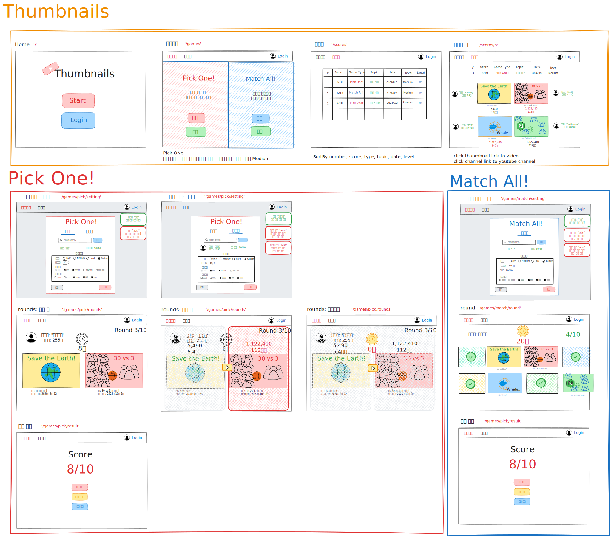

# Thumbnails

Simple game to guess video with more view counts using Youtube thumbnails

Youtube 썸네일을 단서로 진행하는 게임입니다.

- Pick One: Youtube 썸네일로 조회수 높은 영상 맞추는 게임
- Match All: 키워드와 관련된 Youtube 썸네일들을 모두 고르는 게임

# Wireframe

[Excalidraw Wireframe](https://excalidraw.com/#json=4CXHGtihOny0_n--d_XGt,oWfvs_MSWWCaRkEXRgZZjQ)

## 사용 기술

## 구현 상세 내용

## 프로젝트 인스톨 방법

[pnpm 설치](https://pnpm.io/installation) 후 `pnpm install` 실행

## 실행 방법

`npm run dev` 스크립트 실행
